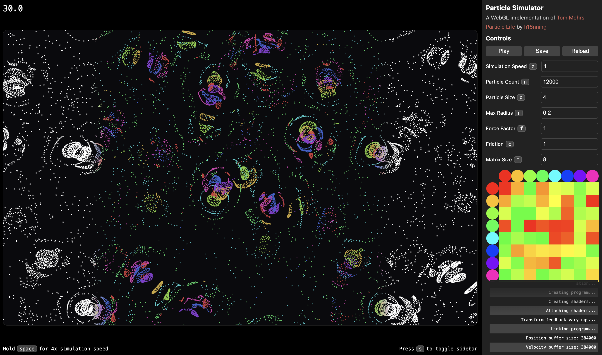

A quick and dirty WebGL implementation of Tom Mohrs particle life. I made this because the client doesn't run on M-series macs. Check out his [YouTube channel](https://www.youtube.com/@tom-mohr) or the [repo](https://github.com/tom-mohr/particle-life-app) here on GitHub.
### Installation

-   clone this repository
-   change to the directory
-   start a live server in your ide / editor of choice

### Running the application

-   All Chromium, WebKit and Gecko browsers work (with limited testing), however since there are differences in the implementation of WebGL, behavior changes are expected.
-   Chromium on macOS: Strongly consider, going to to `chrome://flags` and changing `Choose ANGLE graphics backend` to `OpenGL`, especially experiencing issues. Specific issue: When returning to a tab previously unloaded, the browser may internally disable WebGL in the background, freeze or completely crash! WebGL can be disabled until a complete restarte of your device. Go-to `chrome://gpu` to see the current status.
-   WARN: High partically numbers dramatically increase the computational load (theoretically up to ~n^2). Try starting with a lower particle number like 5k and gradually increase it. Numbers above 20k are generally not recommended and there is a cap at 32k for now. The website may reload, if the particle count is too high, and as a result WebGL context is lost.

### Recommendations

In the sidebar there are several config options, for now there are no boundaries implemented. Especially high or low values can cause issues. General recommendations:

-   Simulations speed, keep as low as possible, especially with high n, large force or small friction factor. Usually <= 1. Don't input negative values.
-   Particle count: see above
-   Particle size: Input any number, number between 2-10 look good. Reduce when particle count is higher, to still make out individual particles.
-   Max Radius: Max distance that particles can interact with, keep between 0.1 and 0.5 for good looking results. For lower max radius you could increase particle count / force, for higher radius to the opposite
-   Force factor and friction: friction should be higher up to 1x to 100x of force factor to have a calm simulation. Friction needs to be >0. Force can be all always (even negative but with potentially unexpected behavior)
-   Matrix: Input can be any value greater than 0, dont input too high numbers (<100) as it will make the page very slow. Higher numbers will also result in a very chaotic simulation. I like ~8. Click `Save` and then `Reload` to apply.

### Troubleshooting

-   Make sure to close some other apps /tabs before opening the website.
-   Make sure hardware acceleration, WebGL, ... are enabled in your browser
